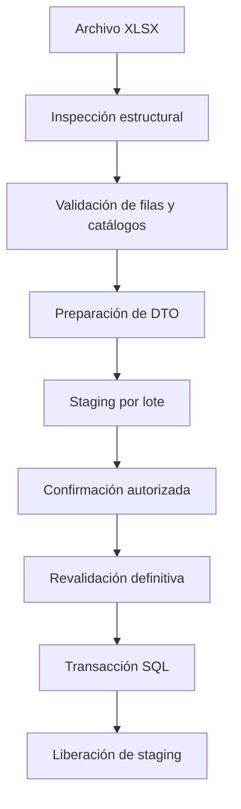

# Arquitectura de SeguimientoFacturacion

## Objetivo

Mantener las reglas de facturación independientes de la interfaz, SQL
Server y Excel, permitiendo que cada componente pueda probarse y
evolucionar sin referencias circulares.

## Capas y dependencias

| Capa | Responsabilidad | Puede depender de |
|---|---|---|
| Domain | Reglas, entidades, value objects y enumeraciones | Ninguna capa |
| Application | Casos de uso, DTO, validación y contratos | Domain |
| Infrastructure | EF Core, SQL Server, ClosedXML y criptografía | Application y Domain |
| Web | MVC, autenticación, autorización y presentación | Application; Infrastructure solo para composición |

La composición de dependencias se realiza en el inicio de Web. Un
controlador consume servicios de Application; nunca utiliza directamente
`DbContext`, `SqlConnection` ni ClosedXML.

## Proyectos

```text
SeguimientoFacturacion.slnx
├── SeguimientoFacturacion.Domain
├── SeguimientoFacturacion.Application
├── SeguimientoFacturacion.Infrastructure
├── SeguimientoFacturacion.Web
├── SeguimientoFacturacion.Domain.Tests
├── SeguimientoFacturacion.Application.Tests
├── SeguimientoFacturacion.Infrastructure.Tests
└── SeguimientoFacturacion.Web.Tests
```

## Flujo de importación



La separación entre análisis y procesamiento evita que un archivo
inválido modifique datos definitivos. La revalidación previa al guardado
protege frente a cambios ocurridos después del análisis.

## Modelo de lotes

`LoteImportacion` conserva:

- Tipo y nombre del archivo.
- Hash SHA-256 para detección de duplicados.
- Totales analizados, válidos, errores y advertencias.
- Estado del ciclo de vida.
- Usuario de creación, confirmación y procesamiento.
- Fechas de análisis, confirmación, inicio y finalización.

Estados:

| Código | Estado |
|---:|---|
| 1 | Pendiente |
| 2 | Analizada |
| 3 | Confirmada |
| 4 | Procesando |
| 5 | Completada |
| 6 | Fallida |
| 7 | Cancelada |

Los registros temporales se relacionan con el lote y se eliminan después
de completar correctamente la transacción definitiva. Los lotes
analizados con novedades pueden conservar evidencia para diagnóstico y
reintento controlado.

## Esquemas de SQL Server

| Esquema | Contenido |
|---|---|
| `facturacion` | Facturas, pacientes, notas, glosas y catálogos |
| `cartera` | Pagos y aplicaciones |
| `importacion` | Lotes, staging e inconsistencias |
| `auditoria` | Eventos inmutables de auditoría |
| `dbo` | Historial de migraciones |

Las restricciones, índices, claves foráneas y precisiones decimales se
configuran mediante Fluent API de Entity Framework Core. El dominio no
utiliza DataAnnotations.

## Agregados y reglas principales

### Factura y paciente

La factura utiliza `FE = PREFIJO + FACTURA` como identificador estable.
El paciente se identifica mediante tipo y número de documento. Una
factura siempre referencia catálogos existentes.

### Notas

- Nota crédito: disminuye el saldo.
- Nota débito: aumenta el saldo.
- Una nota vigente no se importa sobre una factura anulada.
- Toda nota crédito referencia internamente una glosa aceptada de la
  misma factura. La asociación se resuelve durante el análisis y no se
  solicita como dato redundante en Excel.
- El valor acumulado de notas crédito no puede superar el valor
  aceptado de la glosa que las respalda.
- Una anulación de nota requiere motivo.

### Glosas

Las glosas son informativas para el saldo de cartera. Cuando una glosa
aceptada debe producir un efecto financiero, este se materializa mediante
una nota crédito. No se importan glosas sobre facturas anuladas.

### Pagos

Un pago pertenece a una aseguradora y recibo. Sus aplicaciones dividen
el valor recibido entre valor aplicado y anticipo. Siempre se cumple:

```text
ValorRecibido = ValorAplicado + ValorAnticipo
```

Consulte [REGLAS_PAGOS.md](REGLAS_PAGOS.md).

## Transacciones e idempotencia

- Cada procesamiento definitivo utiliza una transacción.
- El hash del archivo permite identificar un lote equivalente.
- Los índices únicos impiden duplicar facturas, notas, glosas, recibos y
  aplicaciones dentro de sus claves de negocio.
- El servicio vuelve a calcular saldos al procesar pagos.
- Un lote completado no se procesa nuevamente.

## Seguridad

### Identidades

Las identidades no se guardan en SQL Server. `usuarios.dat` contiene un
documento JSON cifrado con AES-256-GCM. La clave se obtiene de la
configuración segura del entorno.

Las contraseñas usan PBKDF2-HMAC-SHA256 con sal individual y un mínimo de
600.000 iteraciones. La aplicación nunca conserva la contraseña en texto
plano.

### Autenticación y autorización

- Cookie segura para la sesión web.
- Revalidación de la cuenta contra `usuarios.dat`.
- Roles predeterminados con permisos heredados.
- Concesiones y revocaciones particulares por usuario.
- Políticas compuestas para analizar, confirmar y procesar cada módulo.

### Trazabilidad

Las entidades definitivas conservan `CreadoPor`, `FechaCreacionUtc`,
`ModificadoPor` y `FechaModificacionUtc`. La tabla
`auditoria.RegistrosAuditoria` está preparada para eventos inmutables.

La Fase 2 debe registrar allí cada creación, edición, anulación,
inactivación, respuesta, conciliación, aplicación y reversión manual.

## Decisiones para la Fase 2

- AG Grid será el componente de consulta y edición controlada.
- La grilla consumirá endpoints de Application; no expondrá entidades EF.
- Las modificaciones serán comandos individuales y transaccionales.
- El servidor volverá a validar permisos, concurrencia y reglas.
- Se mostrará `VersionFila` o un equivalente para concurrencia optimista.
- Los indicadores de días serán calculados, no almacenados:
  - factura a radicación;
  - radicación a objeción;
  - objeción a respuesta.

## Restricciones arquitectónicas

- No acceder a SQL Server desde Web.
- No referenciar Infrastructure desde Domain.
- No colocar reglas financieras en controladores o vistas.
- No confiar en validaciones exclusivas de JavaScript.
- No guardar secretos ni datos clínicos reales en Git.
- No modificar migraciones aplicadas; generar una migración nueva.
